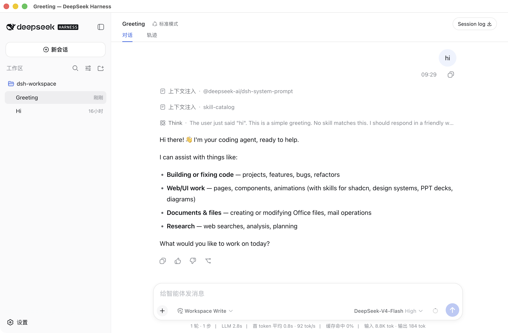

<div align="center">
  
  <h1>DeepSeek Harness Desktop</h1>
  <p><strong>让官方 DeepSeek Harness 开箱即用地运行在桌面上。</strong></p>
  <p>自动跟进官方源码，内置完整运行环境，为 macOS 和 Windows 提供无需另装 Node.js 的桌面体验。</p>
</div>

[English](README.en.md) | 中文 | [中文副本](README.zh.md)

## 项目简介

DeepSeek Harness Desktop 是 [DeepSeek Harness](https://github.com/deepseek-ai/deepseek-harness) 的非官方桌面发行版。它保留官方 Web 应用和本地能力，只负责同步源码、准备运行环境并生成可以直接安装的软件。

项目仍处于开发者预览阶段。桌面版跟随官方快速迭代，功能和数据格式可能发生不兼容变化。

最新安装包请前往 [Releases](https://github.com/tycoding/deepseek-harness-desktop/releases/latest) 下载。最终用户不需要安装 Node.js、npm 或 pnpm。

## 产品特性

- 完整打包官方前端、本地服务和运行环境，不是简单嵌套在线网页。
- 安装后直接在本机运行，最终用户无需安装 Node.js、npm 或 pnpm。
- 每 30 分钟检查官方 `master`，自动把新提交同步到本仓库 `main`。
- 官方版本变化后，自动构建并发布 macOS 和 Windows 安装包。
- 同步、构建或启动检查失败时停止发布，避免产生不可用版本。
- 官方同步不会覆盖桌面代码、发布流程、应用资源和自有文档。

## 运行效果



## 什么是 Harness

Harness 可以理解为 agent（智能体）的运行和组织框架。它把模型、工具、会话、权限、工作流和扩展能力组合在一起，让 agent 不只是回答问题，还能在明确规则下持续完成任务。

DeepSeek Harness 的核心原则是「一切皆插件」。模型提供方、工具、存储、终端和工作流都可以独立组合或替换；桌面版在这套能力之外增加安装、启动和退出管理，不改变官方产品本身的工作方式。

<a id="run"></a><a id="run-from-source"></a>

## 打包规则

- 桌面版版本号始终读取官方根目录的 `package.json`，发布标签使用 `v<官方版本号>`。
- macOS 生成 DMG，Windows 生成安装程序；GitHub Release 同时保留对应版本的源码下载。
- 每个新版本都会成为本仓库的最新可用版本，即使官方版本号包含 `rc` 等预发布标识。
- 每次正式打包前必须先完成官方源码同步、官方项目构建和真实启动检查，任一步失败都会停止发布。
- 安装包包含运行所需的环境和依赖，构建电脑仍需安装 Git、Node.js、pnpm 及当前系统要求的本地构建工具。
- 桌面图标直接使用官方仓库提供的 DeepSeek 图标。

本地生成当前系统安装包：

```sh
cd desktop
npm install
npm run dist
```

生成结果位于 `desktop/dist/`。自动发布由 [桌面发布流程](.github/workflows/desktop-release.yml) 完成。

## 同步规则

- 官方来源固定为 `deepseek-ai/deepseek-harness` 的 `master` 分支，本仓库使用 `main` 分支。
- `desktop/upstream.json` 记录当前已同步的官方提交；每次执行 `npm run dist` 都会先检查并拉取官方最新代码。
- `desktop/protected-paths.json` 列出本仓库独立维护的内容。同步不会改写桌面代码、双语首页、桌面设计记录和发布流程。
- 官方历史被改写或更新产生冲突时，同步会撤销本次操作并停止，不会继续打包不完整的源码。
- 自动发布每 30 分钟检查一次官方 `master`；发现新提交就同步到本仓库 `main`，官方版本号变化后再创建新版本，已发布的版本不会被重复覆盖。

## 桌面端代码

| 位置 | 用途 |
|---|---|
| `desktop/src/` | 桌面窗口、官方服务启动与退出管理 |
| `desktop/scripts/` | 官方同步、版本对齐、运行环境准备、启动检查和打包 |
| `desktop/electron-builder.yml` | macOS、Windows 和 Linux 安装包规则 |
| `desktop/upstream.json` | 当前对应的官方源码版本 |
| `desktop/protected-paths.json` | 同步时必须保留的本仓库文件 |
| `.github/workflows/desktop-release.yml` | 双平台构建与版本发布 |

更详细的构建说明见 [桌面端说明](desktop/README.zh.md)。

## 未来规划

- 持续跟进官方能力和桌面适配，缩短官方更新到桌面版本之间的时间。
- 完成 macOS 与 Windows 的正式签名，减少首次安装时的系统安全提示。
- 增加应用内更新，让用户不必手动下载每个新版本。
- 改进首次启动、配置迁移、故障提示和多平台安装体验。
- 在官方发布节奏稳定后，补充 Linux 安装包和更多系统架构。

## License 与官方地址

- License：[MIT](LICENSE)
- 第三方许可：[THIRD_PARTY_NOTICES.md](THIRD_PARTY_NOTICES.md)
- DeepSeek Harness 官方仓库：[https://github.com/deepseek-ai/deepseek-harness](https://github.com/deepseek-ai/deepseek-harness)
- DeepSeek 官方网站：[https://deepseek.com](https://deepseek.com)
